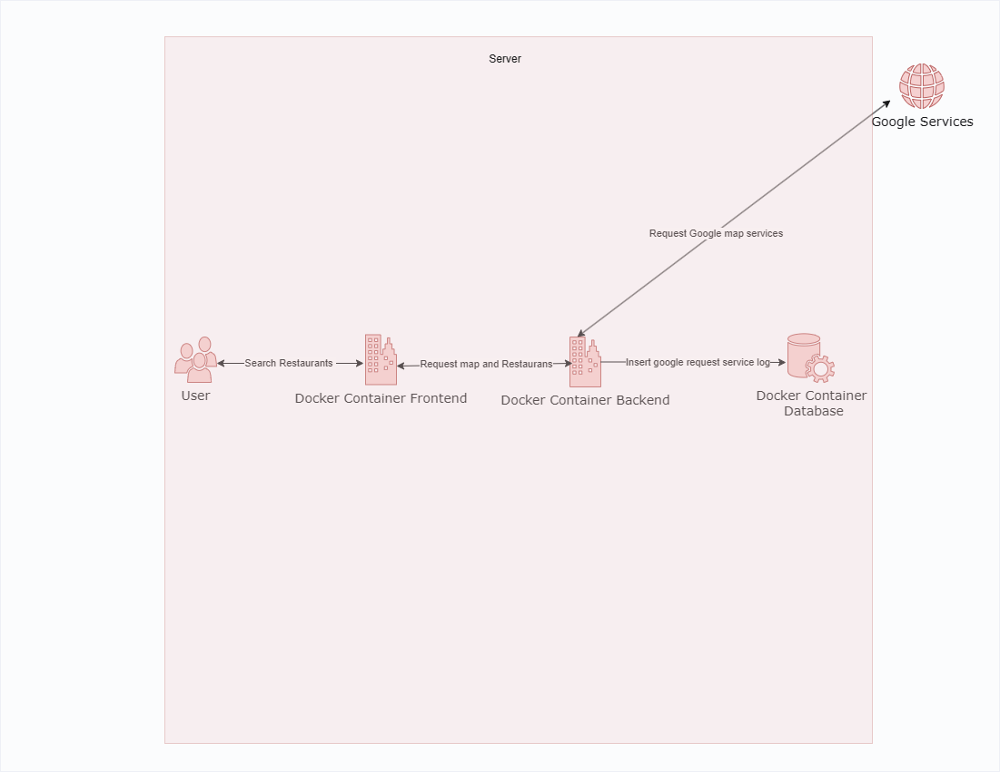

## Show list of Restaurants by using Google map API System

## System Architecture Diagram

## System require
1. operation system
2. node version >= 20.7.0
3. mysql

## Install and Run Project

You’ll start by editing this README file to learn how to edit a file in Bitbucket.

1. Clone a project
2. From root project cd to frontend, backend and backend/database
3. If run on **local** yarn install or npm install
4. Migrate database in backend/database use run script in mysql
5. config .env like .env.example
6. In frontend run **yarn dev** backend run **yarn start:dev**
7. If run **Docker** in frontend run "docker build -t frontend ." in backend run "docker build -t backend ." and in backend/database run "docker build -t database ."
8. Start docker container run "docker-compose -f docker-compose.yml up" in root project

## If run **Docker** only one command in root project "docker build -t database backend/database/. && docker build -t frontend frontend/. && docker build -t backend backend/. && docker-compose -f docker-compose.yml up"